# Table of Contents

- [Table of Contents](#table-of-contents)
  - [Introduction](#introduction)
  - [Prerequisites](#prerequisites)
    - [.NET 6.0](#net-60)
    - [Visual Studio 2022](#visual-studio-2022)
    - [Required Workloads](#required-workloads)
    - [Google Account](#google-account)
    - [Google Cloud Platform Account](#google-cloud-platform-account)
  - [Demo](#demo)
    - [Clone the MsalSocialAuthInMaui Repo](#clone-the-msalsocialauthinmaui-repo)
    - [User Flow Testing with jwt.ms](#user-flow-testing-with-jwtms)
    - [Refactoring and Clean-up](#refactoring-and-clean-up)
      - [*appsettings.json*](#appsettingsjson)
      - [*Settings.cs*](#settingscs)
    - [Add Google OAuth 2.0 Authentication Support](#add-google-oauth-20-authentication-support)
      - [Create a New User Flow](#create-a-new-user-flow)
      - [Configure Google Identity Provider](#configure-google-identity-provider)
    - [Add Google Authentication Support in MAUI](#add-google-authentication-support-in-maui)
  - [Summary](#summary)
  - [Complete Code](#complete-code)
  - [Resources](#resources)

## Introduction

In this episode, we are going to keep building up our previous **MSAL Auth** demos, and add **Google OAuth2.0 Authorization** support to our MAUI app. To keep things simple, and separate, let's do a recount of what we have done in the previous demos.

| Episode                                                                             | YouTube URL                                   | GitHub Repo URL                                        |
| ----------------------------------------------------------------------------------- | --------------------------------------------- | ------------------------------------------------------ |
| Calling Secured APIs with MSAL Auth in MAUI: The .NET Show with Carl Franklin Ep 24 | <https://www.youtube.com/watch?v=p8NRvakFW2M> | <https://github.com/carlfranklin/MsalAuthInMaui>       |
| MSAL Twitter Auth in MAUI: The .NET Show with Carl Franklin Ep 25                   | <https://www.youtube.com/watch?v=AIO2qOKC7Vc> | <https://github.com/carlfranklin/MsalSocialAuthInMaui> |

>:point_up: If you haven't followed along, this is a good opportunity to start from the beginning before proceeding with this demo, as we will need our **SecureWebApi** up and running, as well as **Client ID**, and **Secret** values from the previous demos.

The end results will look like this:

|                                                     |                                                 |
| --------------------------------------------------- | ----------------------------------------------- |
| 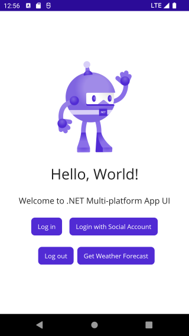 | 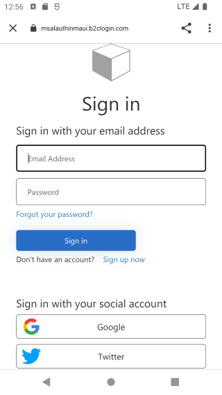 |

Let's get to it.

## Prerequisites

The following prerequisites are needed for this demo.

### .NET 6.0

Download the latest version of the .NET 6.0 SDK [here](https://dotnet.microsoft.com/en-us/download).

### Visual Studio 2022

For this demo, we are going to use the latest version of [Visual Studio 2022](https://visualstudio.microsoft.com/vs/community/).

### Required Workloads

In order to build ASP.NET Core Web API applications, the **ASP.NET and web development** workload needs to be installed. In order to build **.NET MAUI** applications, you also need the **.NET Multi-platform App UI development** workload, so if you do not have them installed let's do that now.

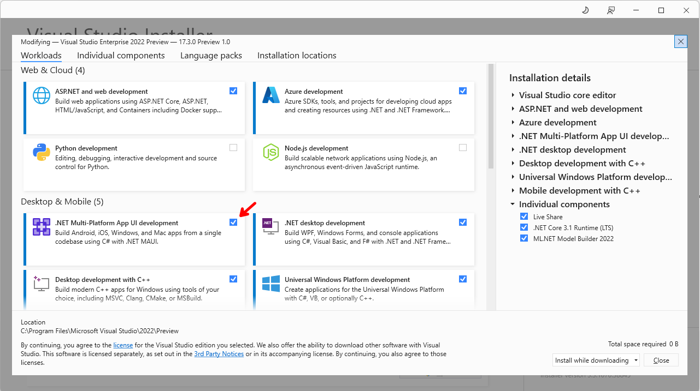  

### Google Account

If you do not have a **Google Account**, go ahead and create one [here](https://accounts.google.com/signup).

### Google Cloud Platform Account

You will also need a **Google Cloud Platform** account, to access the **Google Developers Console**, so if you do not have one, go ahead and create one [here](https://console.developers.google.com/).

## Demo

In the following demo let's start by cloning the **MsalSocialAuthInMaui** repo, and then we are going to do some minor refactoring, and cleaning-up.

### Clone the MsalSocialAuthInMaui Repo

The starting point of this demo is the [MsalSocialAuthInMaui](https://github.com/carlfranklin/MsalSocialAuthInMaui)` repo, so let's clone it.

```powershell
git clone https://github.com/carlfranklin/MsalSocialAuthInMaui
```

### User Flow Testing with jwt.ms

If you recall in the previous episode, we created a **Sign-up, and Sign-in** user flow, and then we tested it inside of **Azure AD B2C**.

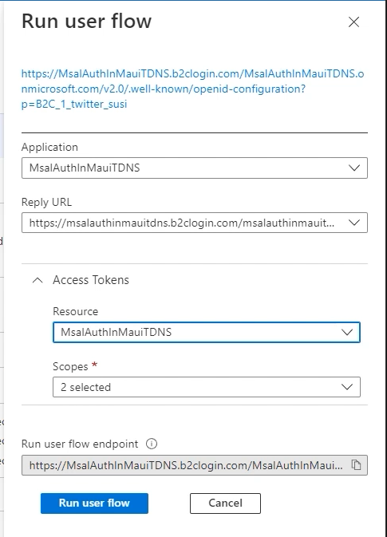  

The test succeeded, but as you can see in the image above, we provided our **SecureWebApi** endpoint for the **Reply URL**. This allowed us to see the response, including the access token returned, which is good. We considered this a successful test.

However, I found a better way not to only view the access token, but also parse it, and view it's attributes and claims, using **jwt.ms**.

Go to your **Azure AD B2C** account, and then to your **App Registrations**. Pick your app, **MsalAuthInMaui`<YOUR-SUFFIX>`**, and go to **Authentication**. Then under **Mobile and desktop applications/Redirect URIs** add the following URI: **https://jwt.ms**.

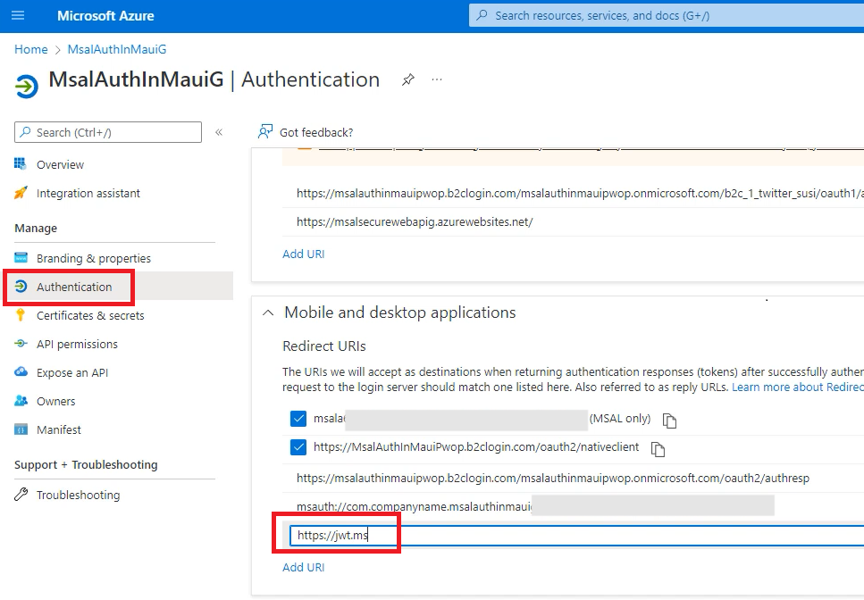  

Go back to the main **Azure AD B2C** menu, and select **User flows**, under **Policies**.

Then click on the **B2C_1_twitter_susi** user flow, and click on **Run user flow**.

Now you will be able to select **https://jwt.ms** as the **Reply URL**.`

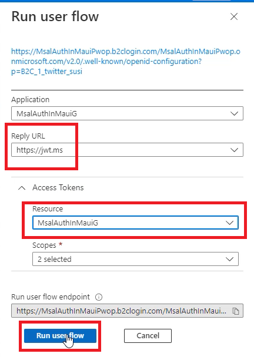

When you complete the test, and sign in with Twitter, you will be presented with your access token, and the decoded token, and claims.

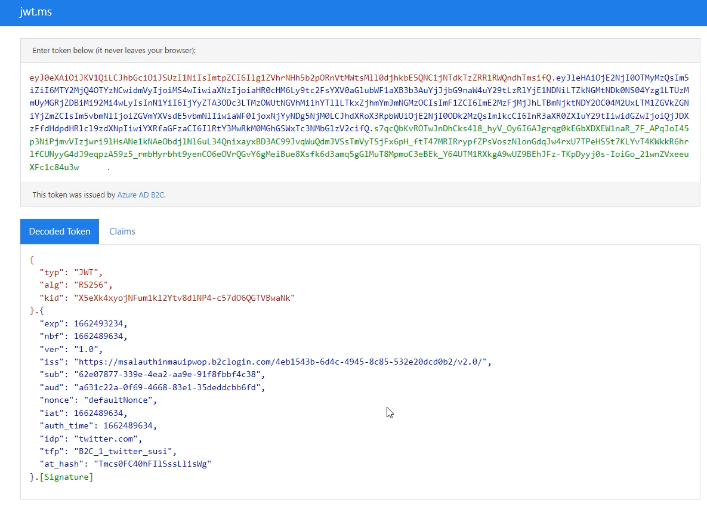  

### Refactoring and Clean-up

Before we start with Google Authentication support, I would like to perform some minor refactoring, and clean-up.

In the last demo, we created a user flow for Twitter, and we called it **B2C_1_twitter_susi**, which made sense, as it provided authentication flow for Twitter. As we add more identity providers, such as Google, we do not need to create another user flow for Google, we can use the same user flow for multiple identity providers, so renaming that to something like **B2C_1_social_susi** or **B2C_1_msalauthinmaui_susi** would make more sense.

Azure does not provide the ability to rename a user flow, which make sense as the name is provided when integrating our user flows, so allowing to rename could potentially break your own integrations.

So, we are going to create a new **B2C_1_social_susi** user flow in a later step, but for now, let's rename our settings in *appsettings.json*, and our properties in *Settings.cs*, in our **MsalAuthInMaui** app, and replace any references of **ForTwitter** with just **Social**.

#### *appsettings.json*

```json
{
  "Settings": {
    "ClientId": "",
    "TenantId": "",
    "Authority": "",
    "Scopes": [
      { "Value": "" }
    ],
    "ClientIdSocial": "",
    "TenantSocial": "",
    "TenantIdSocial": "",
    "InstanceUrlSocial": "",
    "PolicySignUpSignInSocial": "",
    "AuthoritySocial": "",
    "ScopesSocial": [
      { "Value": "" }
    ]
  }
}
```

>:point_up: Notice I replaced the settings suffix from **ForTwitter** to **Social**, and that the values have been removed. You want to keep your existing values for each setting.

#### *Settings.cs*

```csharp
namespace MsalAuthInMaui
{
    public class Settings
    {
        // Azure AD B2C Microsoft Authentication
        public string ClientId { get; set; } = null;
        public string TenantId { get; set; } = null;
        public string Authority { get; set; } = null;
        public NestedSettings[] Scopes { get; set; } = null;

        // Azure AD B2C Social Authentication
        public string ClientIdSocial { get; set; } = null;
        public string TenantSocial { get; set; } = null;
        public string TenantIdSocial { get; set; } = null;

        public string InstanceUrlSocial { get; set; } = null;
        public string PolicySignUpSignInSocial { get; set; } = null;
        public string AuthoritySocial { get; set; } = null;
        public NestedSettings[] ScopesSocial { get; set; } = null;
    }
}
```

>:point_up: Make sure you use Visual Studio rename capabilities, to take advantage of renaming any references at once.

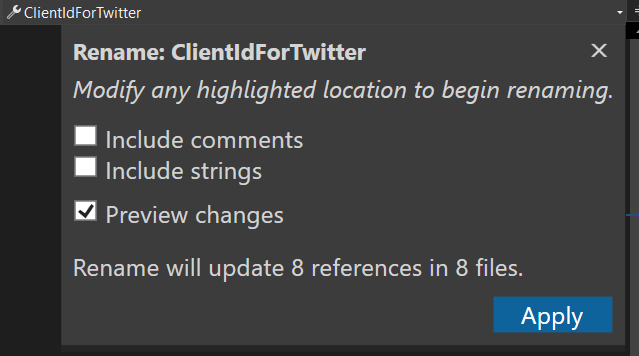  

Finally, let's get rid of these two warnings:

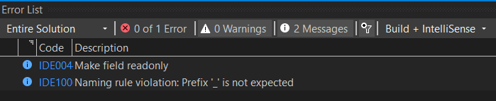  

Change the following code in *PCASocialWrapper.cs*, and *PCAWrapper.cs*.

From this:

```csharp
private IConfiguration _configuration;
private static Settings _settings { get; set; }
```

To this:

```csharp
private readonly IConfiguration _configuration;
private readonly Settings _settings;
```

Now we are ready to move forward with **Google OAuth2.0 Authentication**.

### Add Google OAuth 2.0 Authentication Support

In this demo, we are going to add the ability to authenticate in our application with Google, while we keep Twitter authentication, and still be able to call our secure Web API.

Log in to the **Google Developers Console** in the **Google Cloud Platform** from this [link](https://console.developers.google.com/).

Click on the project list down arrow to open the **Select a project** modal screen.

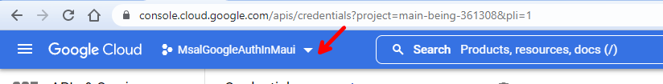  

Click on **NEW PROJECT**.

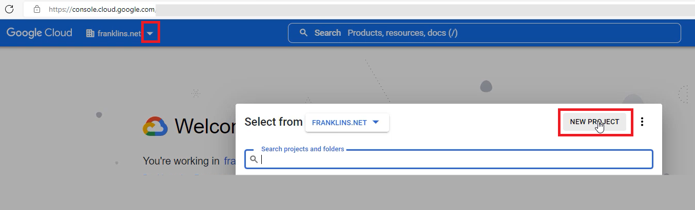  

Give it a name, and click on **CREATE**.

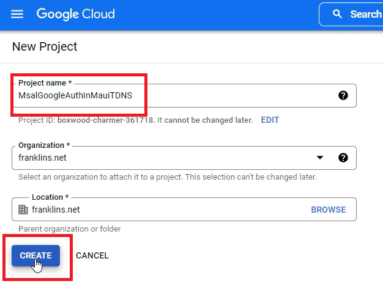 

Once the project is created, click on **SELECT PROJECT** under **Notifications**.

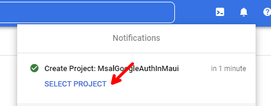  

Now go to the **OAuth consent screen** on the left menu, select **External** for the **User Type**, and click on **CREATE**.

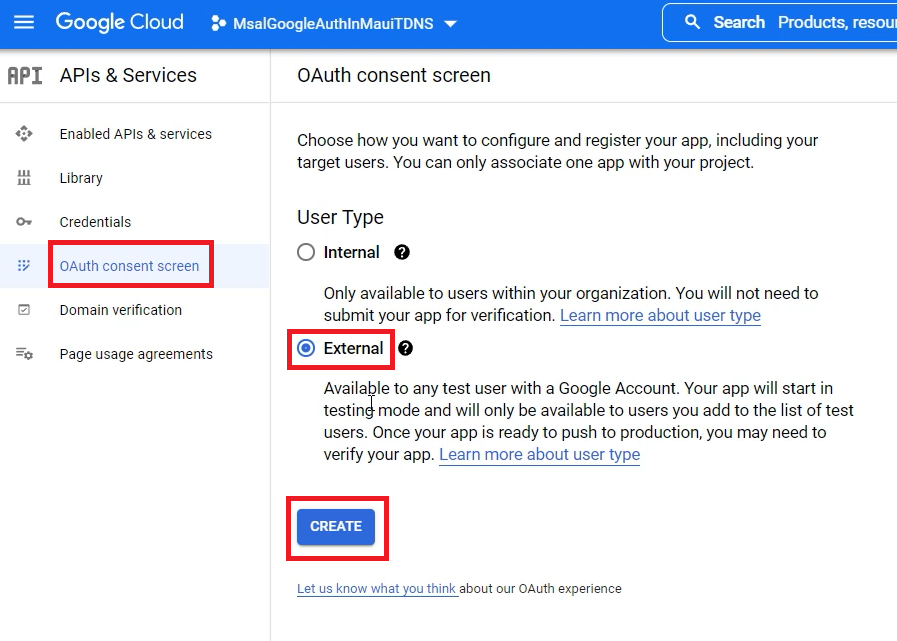  

Fill-out the required fields, and make sure you specify **b2clogin.com** as the **Authorized domain 1**, then click on **SAVE AND CONTINUE**.

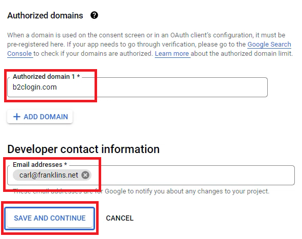

 Select **Credentials** on the left, and then click on **CREATE CREDENTIALS**.

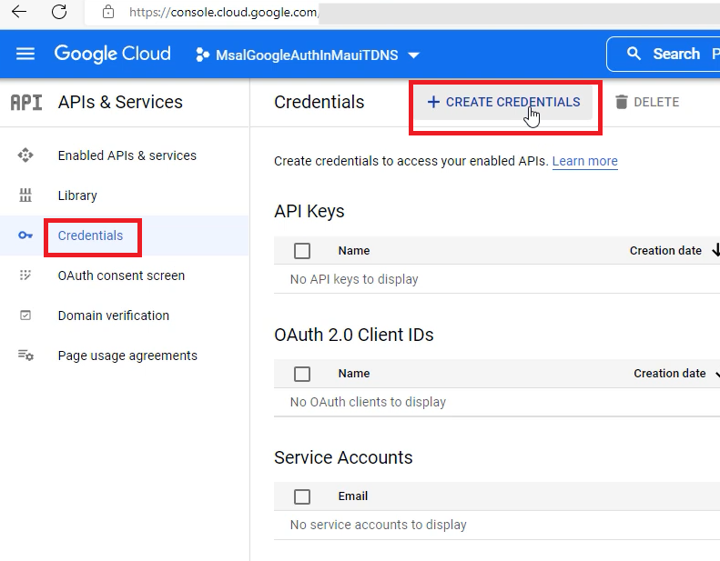  

Then select **OAuth client ID**.

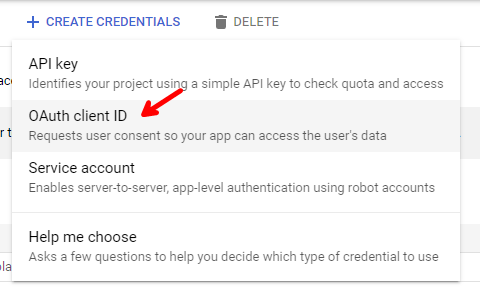  

Select **Web application** for the **Application Type**. Give it a name, and add **https://msalauthinmaui`<YOUR-SUFFIX>`.b2clogin.com** for the **Authorized JavaScript origins** URIs, and **https://msalauthinmaui`<YOUR-SUFFI>`.b2clogin.com/msalauthinmaui`<YOUR-SUFFIX>`.onmicrosoft.com/oauth2/authresp** for the **Authorized redirect URIs**.

Then click on **CREATE**.

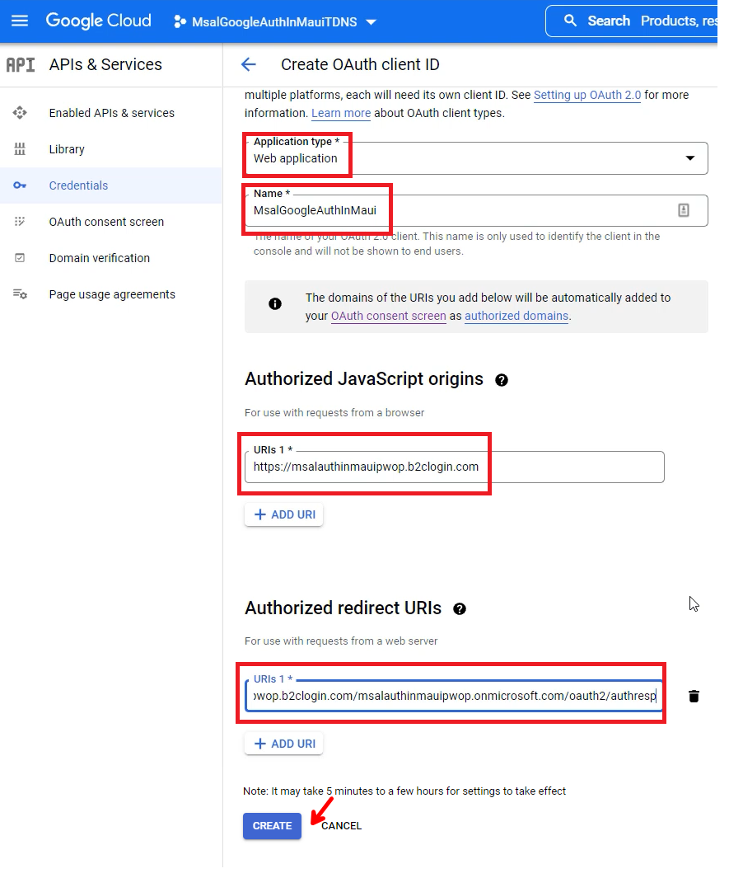  

You will be presented with your **Client ID**, and **Client Secret**.

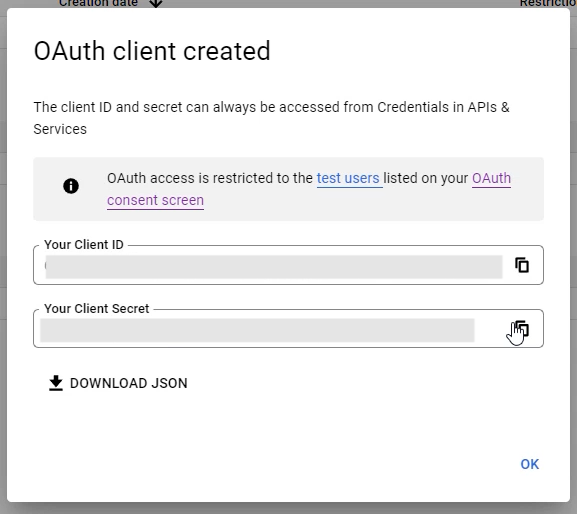  

Copy the values temporarily as we are going to need them when we setup our Google identity provider in **Azure AD B2C** in the [Create a User Flow](#create-a-user-flow) step below.

>:point_up: There is no need to store this values, as you can retrieve them from the **Google Developers Console** at any time in the future.

And that is it in the **Google Developers Console**. Now let's move back to **Azure AD B2C**, and create a new **User Flow**.

#### Configure Google Identity Provider

On the left menu, click on **Identity Providers**, and select **Google**.

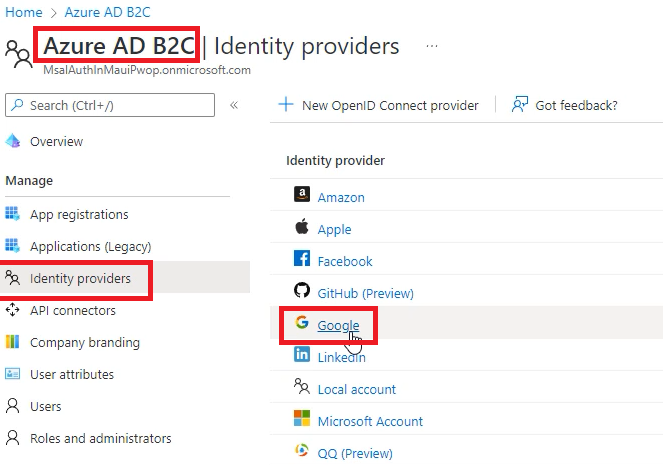 

Give it a name, and enter the **Client ID**, and **Client secret** you copied in the [Add Google Authentication Support](#add-google-authentication-support) step, then click on **Save**.

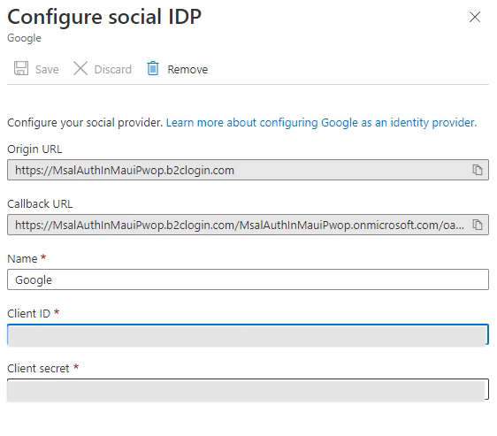  

#### Create a New User Flow

Go back to your **Azure AD B2C** tenant, click on **User flows**, then on **New user flow**.

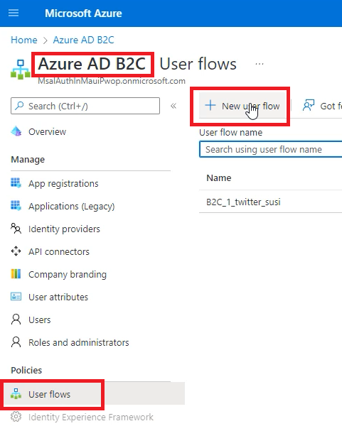  

Select **Sign up and sign in** for the **Flow type**, and the recommended **Version**.

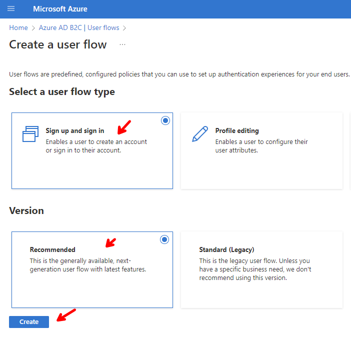  

Give it a name of **social_susi**, select **Email signup** under **Local accounts**, and select **Google**, and **Twitter** under **Social identity providers**.

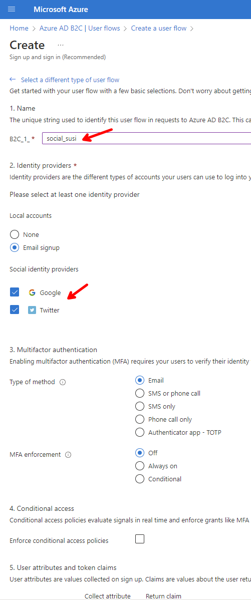  

Then click on **Show more** under **User attributes and token claims** at the bottom, to display other attributes. Then select **Display Name**, click **OK**,  and then **Create**.

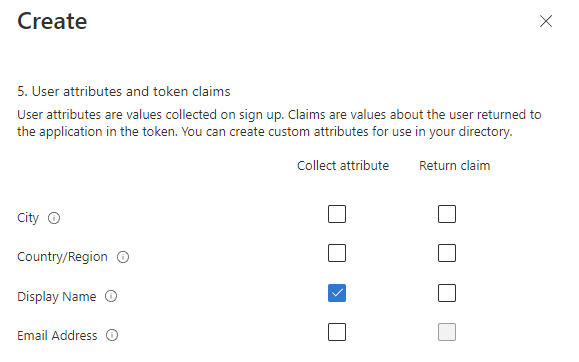  

Your new **User flow** shows up.

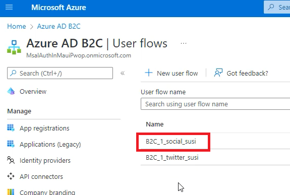

>:point_up: (Optional) you can go ahead, and delete the previous **B2C_1_twitter_susi** if you want.

Go back to your **App Registrations**, and select your app, and then **Authentication**. Add the following **Redirect URI** under **Mobile and desktop applications**: `https://msalauthinmaui<YOUR-SUFFIX>.b2clogin.com/msalauthinmaui<YOUR-SUFFIX>.onmicrosoft.com/oauth2/authresp`, and click **Save**.

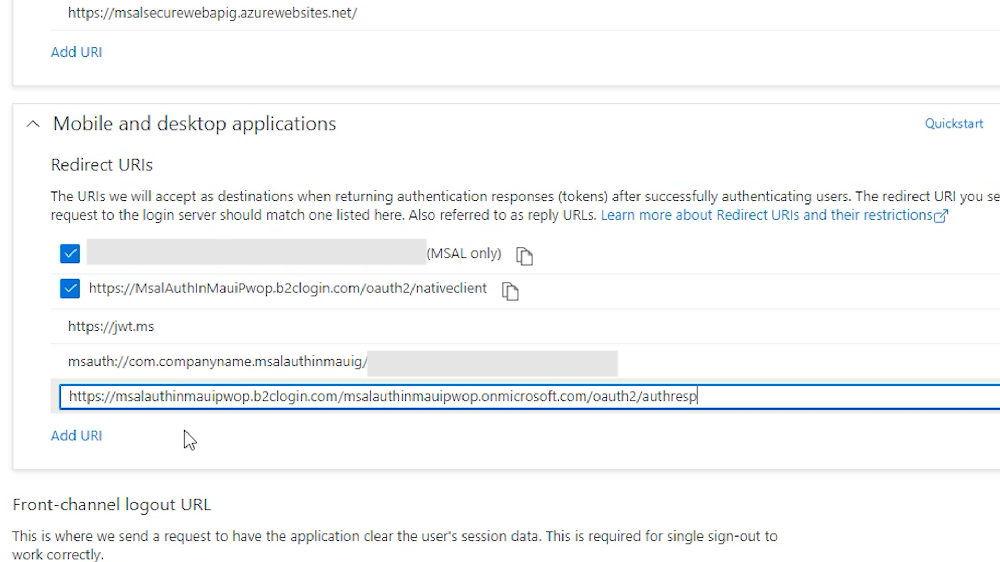

>:point_up: Make sure you replace your `<YOUR-SUFFIX>` with your own value.

Finally, open up *appsettings.json* in the `MsalAuthInMaui` project, and replace **b2c_1_twitter_susi** with **b2c_1_social_susi**, under the **PolicySignUpSignInSocial**, and **AuthoritySocial** settings.

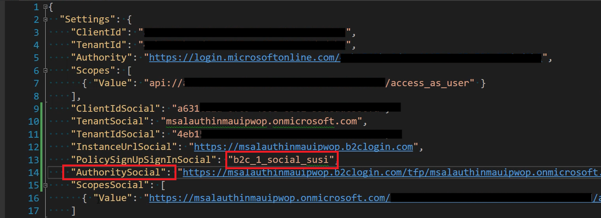

We have successfully configured **Google Authentication** support for our MAUI app, and in theory this should be it, our app should be ready for test, as the identity providers are configured in **Azure AD B2C**, and no extra settings are needed for each provider. However, as of September 2021, Google deprecated support for using embedded browsers for authentication.

If you try to use the embedded browser, you will get an error like this:

  

We have been using the embedded browser in our previous demos, but now we need to change that to use the system's browser. That is not a bad thing or hard to do as **MSAL** supports both. As a matter of fact the recommended browser's is the system's browser, so let's make that change.

### Add Google Authentication Support in MAUI

Using the system's browser provides better support for caching credentials, and there is simple setting we need to change to use it.

Open *PCASocialWrapper.cs*, and change `.WithUseEmbeddedWebView(true)` to `.WithUseEmbeddedWebView(false)`.

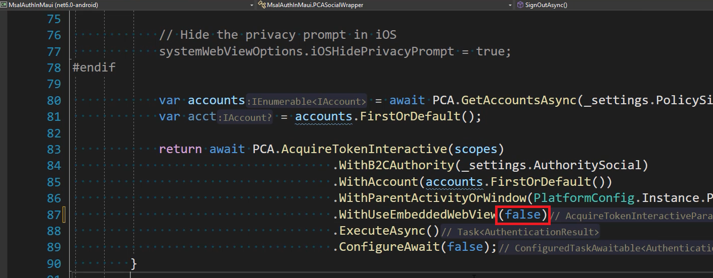

When we were using the embedded browser, we were being redirected back to our application automatically, as the embedded browser was inside our application. In order to use the system's browser, we need to create an **Android** intent, to be able to redirect back to our application after the authentication flow.

Add a new *MsalActivity.cs* file, under the *Platforms/Android* folder, with the following code:

```csharp
using Android.App;
using Android.Content;
using Microsoft.Identity.Client;

namespace MsalAuthInMaui.Platforms.Android
{
    [Activity(Exported = true)]
    [IntentFilter(new[] { Intent.ActionView },
        Categories = new[] { Intent.CategoryBrowsable, Intent.CategoryDefault },
        DataHost = "auth",
        DataScheme = "msal<YOUR-CLIENT-ID>")]
    public class MsalActivity : BrowserTabActivity
    {
    }
}
```

>:point_up: Make sure you replace \<YOUR-CLIENT-ID> with your actual Client ID that you can find in your *appsettings.json* file.

Finally, let's make some final changes into our *MainPage.xaml*, and *MainPage.xaml.cs* files to update our UI accordingly.

File *MainPage.xaml*

```xaml
<?xml version="1.0" encoding="utf-8" ?>
<ContentPage xmlns="http://schemas.microsoft.com/dotnet/2021/maui"
			 xmlns:x="http://schemas.microsoft.com/winfx/2009/xaml"
			 x:Class="MsalAuthInMaui.MainPage">

	<ScrollView>
		<VerticalStackLayout Spacing="25"
							 Padding="30,0"
							 VerticalOptions="Center">

			<Image Source="dotnet_bot.png"
				   SemanticProperties.Description="Cute dot net bot waving hi to you!"
				   HeightRequest="200"
				   HorizontalOptions="Center" />

			<Label Text="Hello, World!"
				   SemanticProperties.HeadingLevel="Level1"
				   FontSize="32"
				   HorizontalOptions="Center" />

			<Label Text="Welcome to .NET Multi-platform App UI"
				   SemanticProperties.HeadingLevel="Level2"
				   SemanticProperties.Description="Welcome to dot net Multi platform App U I"
				   FontSize="18"
				   HorizontalOptions="Center" />

			<HorizontalStackLayout 
				HorizontalOptions="Center">
				<Button x:Name="LoginButton"
						Text="Log in"
						SemanticProperties.Hint="Log in"
						Clicked="OnLoginButtonClicked"
						HorizontalOptions="Center"
						Margin="8,0,8,0" />
				<Button x:Name="LoginSocialButton"
						Text="Login with Social Account"
						SemanticProperties.Hint="Log in with your social account"
						Clicked="OnLoginSocialButtonClicked"
						HorizontalOptions="Center"
						Margin="8,0,8,0" />				
			</HorizontalStackLayout>

			<HorizontalStackLayout HorizontalOptions="Center">
				<Button x:Name="LogoutButton"
					Text="Log out"
					SemanticProperties.Hint="Log out"
					Clicked="OnLogoutButtonClicked"
					HorizontalOptions="Center"
					Margin="8,0,8,0" />

			<Button x:Name="GetWeatherForecastButton"
					Text="Get Weather Forecast"
					SemanticProperties.Hint="Get weather forecast data"
					Clicked="OnGetWeatherForecastButtonClicked"
					HorizontalOptions="Center"
					IsEnabled="{Binding IsLoggedIn}"/>
			</HorizontalStackLayout>
		</VerticalStackLayout>
	</ScrollView>
</ContentPage>
```

File *MainPage.xaml.cs*

```csharp
using Microsoft.Extensions.Configuration;
using Microsoft.Identity.Client;

namespace MsalAuthInMaui
{
    public partial class MainPage : ContentPage
    {
        private string _accessToken = string.Empty;
        private readonly PCAWrapper _pcaWrapper;
        private readonly PCASocialWrapper _pcaSocialWrapper;
        private readonly IConfiguration _configuration;

        bool _isLoggedIn = false;
        public bool IsLoggedIn
        {
            get => _isLoggedIn;
            set
            {
                if (value == _isLoggedIn) return;
                _isLoggedIn = value;
                OnPropertyChanged(nameof(IsLoggedIn));
            }
        }

        public MainPage(IConfiguration configuration)
        {
            _configuration = configuration;
            _pcaWrapper = new PCAWrapper(_configuration);
            _pcaSocialWrapper = new PCASocialWrapper(_configuration);
            BindingContext = this;
            InitializeComponent();
            // _ = Login(_pcaWrapper);
        }

        async private void OnLoginButtonClicked(object sender, EventArgs e)
        {
            await Login(_pcaWrapper).ConfigureAwait(false);
        }

        async private void OnLoginSocialButtonClicked(object sender, EventArgs e)
        {
            await Login(_pcaSocialWrapper).ConfigureAwait(false);
        }

        private async Task Login(IPCAWrapper pcaWrapper)
        {
            try
            {
                // Attempt silent login, and obtain access token.
                var result = await pcaWrapper.AcquireTokenSilentAsync(pcaWrapper.Scopes).ConfigureAwait(false);
                IsLoggedIn = true;

                // Set access token.
                _accessToken = result.AccessToken;

                // Display Access Token from AcquireTokenSilentAsync call.
                await ShowOkMessage("Access Token from AcquireTokenSilentAsync call", _accessToken).ConfigureAwait(false);
            }
            // A MsalUiRequiredException will be thrown, if this is the first attempt to login, or after logging out.
            catch (MsalUiRequiredException)
            {
                try
                {
                    // Perform interactive login, and obtain access token.
                    var result = await pcaWrapper.AcquireTokenInteractiveAsync(pcaWrapper.Scopes).ConfigureAwait(false);
                    IsLoggedIn = true;

                    // Set access token.
                    _accessToken = result.AccessToken;

                    // Display Access Token from AcquireTokenInteractiveAsync call.
                    await ShowOkMessage("Access Token from AcquireTokenInteractiveAsync call", _accessToken).ConfigureAwait(false);
                }
                catch
                {
                    // Ignore.
                }
            }
            catch (Exception ex)
            {
                IsLoggedIn = false;
                await ShowOkMessage("Exception in AcquireTokenSilentAsync", ex.Message).ConfigureAwait(false);
            }
        }

        async private void OnLogoutButtonClicked(object sender, EventArgs e)
        {
            // Log out from Microsoft.
            await _pcaWrapper.SignOutAsync().ConfigureAwait(false);

            // Log out from Social.
            await _pcaSocialWrapper.SignOutAsync().ConfigureAwait(false);

            await ShowOkMessage("Signed Out", "Sign out complete.").ConfigureAwait(false);
            IsLoggedIn = false;
            _accessToken = string.Empty;
        }

        async private void OnGetWeatherForecastButtonClicked(object sender, EventArgs e)
        {
            // Call the Secure Web API to get the weatherforecast data.
            var weatherForecastData = await CallSecureWebApi(_accessToken).ConfigureAwait(false);

            // Show the data.
            if (weatherForecastData != string.Empty)
                await ShowOkMessage("WeatherForecast data", weatherForecastData).ConfigureAwait(false);
        }

        // Call the Secure Web API.
        private static async Task<string> CallSecureWebApi(string accessToken)
        {
            if (accessToken == string.Empty)
                return string.Empty;

            try
            {
                // Get the weather forecast data from the Secure Web API.
                var client = new HttpClient();

                // Create the request.
                var message = new HttpRequestMessage(HttpMethod.Get, "{REPLACE-WITH-YOUR-SECURE-WEB-API-URL}/weatherforecast");

                // Add the Authorization Bearer header.
                message.Headers.Add("Authorization", $"Bearer {accessToken}");

                // Send the request.
                var response = await client.SendAsync(message).ConfigureAwait(false);

                // Get the response.
                var responseString = await response.Content.ReadAsStringAsync().ConfigureAwait(false);

                // Ensure a success status code.
                response.EnsureSuccessStatusCode();

                // Return the response.
                return responseString;
            }
            catch (Exception ex)
            {
                return ex.ToString();
            }
        }

        private Task ShowOkMessage(string title, string message)
        {
            _ = Dispatcher.Dispatch(async () =>
            {
                await DisplayAlert(title, message, "OK").ConfigureAwait(false);
            });
            return Task.CompletedTask;
        }
    }
}
```

And that's it! Run the MAUI app, and try login in with Google, and get the Weather Forecast data.

|                                                              |                                                              |                                                     |
| ------------------------------------------------------------ | ------------------------------------------------------------ | --------------------------------------------------- |
|  |  | 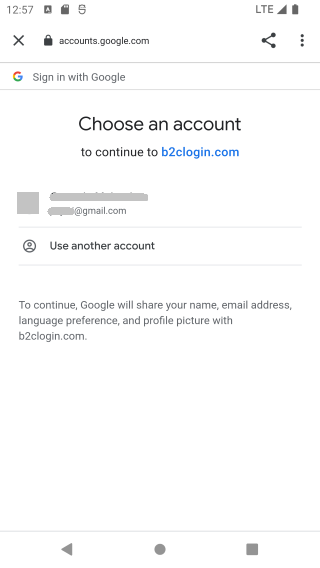 |
| 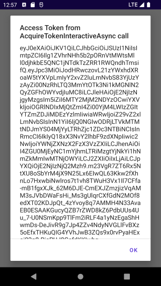         | 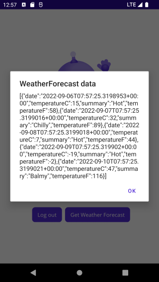 |                                                     |

### Fix the Twitter Credentials

If you try right now to log in with Twitter, you'll get an error. That's because the Twitter redirect url still has `_twitter_susi` in it. We need to go back to the Twitter developer console, to the Authentication settings, and change the url:

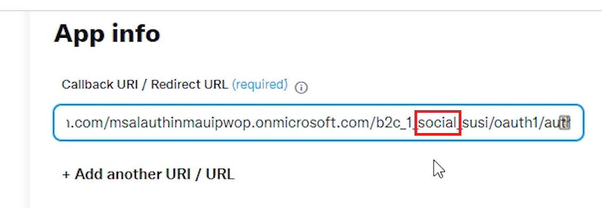

And now your Twitter auth will work as it did before!

## Summary

In this episode, we added Google authorization support to the [MsalSocialAuthInMaui](https://github.com/carlfranklin/MsalSocialAuthInMaui) repo we built in the last episode.

We made some minor refactoring, and took care of two warnings.

Finally, we configured our MAUI application, to login with Google, while keeping Twitter support added in the previous demo.

For more information about .NET MAUI, Azure AD B2C Identity providers, and Google OAuth Authentication, check the links in the resources section below.

## Complete Code

The complete code for this demo can be found in the link below.

- <https://github.com/carlfranklin/MsalGoogleAuthInMaui>

## Resources

| Resource Title                                               | Url                                                          |
| ------------------------------------------------------------ | ------------------------------------------------------------ |
| The .NET Show with Carl Franklin                             | <https://www.youtube.com/playlist?list=PL8h4jt35t1wgW_PqzZ9USrHvvnk8JMQy_> |
| Download .NET                                                | <https://dotnet.microsoft.com/en-us/download>                |
| .NET Multi-platform App UI documentation                     | <https://docs.microsoft.com/en-us/dotnet/maui/>              |
| Overview of the Microsoft Authentication Library (MSAL)      | <https://docs.microsoft.com/en-us/azure/active-directory/develop/msal-overview> |
| Calling Secured APIs with MSAL Auth in MAUI: The .NET Show with Carl Franklin Ep 24 | <https://www.youtube.com/watch?v=p8NRvakFW2M>                |
| Calling Secured APIs with MSAL Auth in MAUI: Repo            | <https://github.com/carlfranklin/MsalAuthInMaui>             |
| MSAL Twitter Auth in MAUI: The .NET Show with Carl Franklin Ep 25 | <https://www.youtube.com/watch?v=AIO2qOKC7Vc>                |
| MSAL Twitter Auth in MAUI: Repo                              | <https://github.com/carlfranklin/MsalSocialAuthInMaui>       |
| Set up sign-up and sign-in with a Google account using Azure Active Directory B2C | <https://docs.microsoft.com/en-us/azure/active-directory-b2c/identity-provider-google?WT.mc_id=Portal-Microsoft_AAD_B2CAdmin&pivots=b2c-custom-policy>Give it a name of **social_susi**, select **Email signup** under **Local accounts**, and select **Google**, and **Twitter** under **Social identity providers**. |